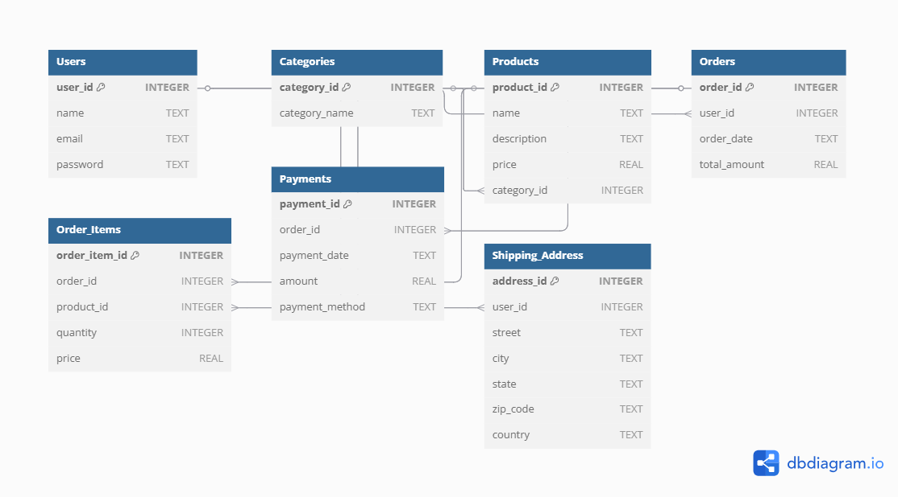

# 🛒 E-commerce Database Schema (SQLite)

This project is created as part of *Task 1 – Database Setup and Schema Design* for the SQL Developer Internship. It involves designing and implementing a relational database schema for an E-commerce website using *SQLite* and *SQLiteStudio*.

## 📚 Project Overview

The goal is to create a normalized, relational database that supports key operations of an online shopping platform. The schema is designed to handle users, products, categories, orders, payments, and shipping addresses with proper relationships and constraints.

## 🧱 Database Tables

- Users
- Products
- Categories
- Orders
- Order_Items
- Payments
- Shipping_Address

## 🔗 Relationships

- A user can place many orders
- Each order can have multiple order items
- Each order item refers to a specific product
- Each product belongs to one category
- Each order has one payment
- Each user can have multiple shipping addresses

## 🗃️ ER Diagram

> The following diagram illustrates all the entities and their relationships:

## 🛠 Tech Stack

- *Database Engine:* SQLite
- *Tool Used:* SQLiteStudio 3.4.17
- *Query Language:* SQL (DDL statements)

## 📄 Files Included

- schema.sql – Contains SQL DDL statements to create tables
- er_diagram.png – ER Diagram image showing relationships

## ⚙️ How to Use

1. Open *SQLiteStudio*
2. Create a new SQLite database
3. Open the SQL Editor
4. Paste code from schema.sql
5. Run the script (F9 or Play button)

## 💡 Key Concepts Used

- DDL Commands (CREATE TABLE, FOREIGN KEY, PRIMARY KEY)
- Relationships (1:N)
- AUTOINCREMENT primary keys
- Unique constraints (UNIQUE)
- Foreign key constraints for data integrity
- Normalized design (no data redundancy)

## 👩‍💻 Author

*Triveni Shinde*  
Final-Year B.Tech (Information Technology)  
Database & Web Development Enthusiast  
GitHub: [your GitHub link here]
